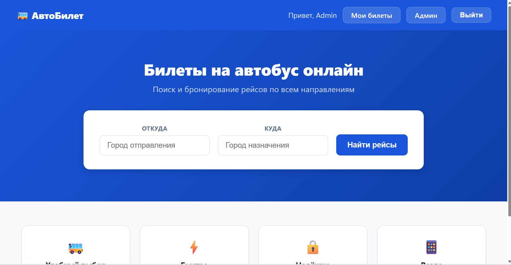
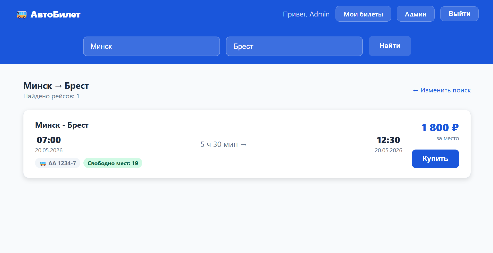
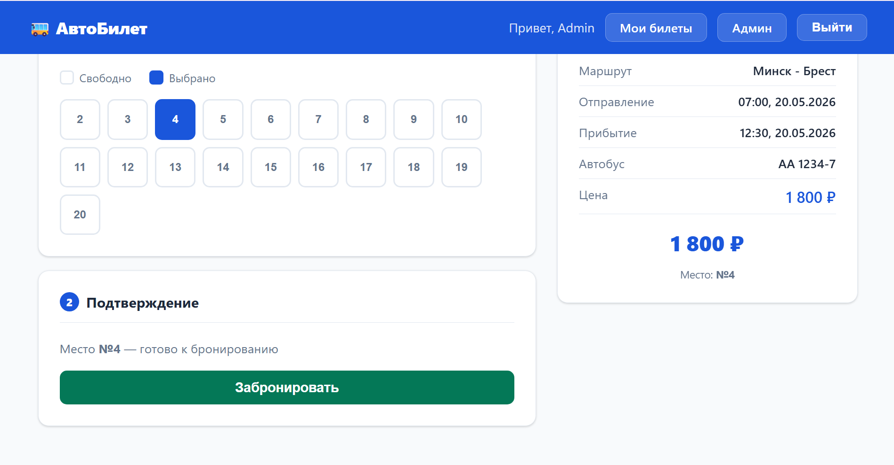

# Bus Ticket Reservation System

REST API бэкенд для онлайн-бронирования автобусных билетов с JWT-аутентификацией, ролевой моделью доступа и статическим фронтендом.

## Стек технологий

- **Java 17**, **Spring Boot**
- **Spring Security** — JWT (Access + Refresh токены), BCrypt
- **Spring Data JPA** / **Hibernate**
- **PostgreSQL**
- **Lombok**, **Maven**

## Возможности

- Регистрация и вход с выдачей JWT
- Ролевая модель: `USER` и `ADMIN`
- Поиск рейсов по маршруту
- Бронирование, оплата и отмена билетов
- Профиль пассажира
- DTO + Mapper паттерн
- Глобальная обработка ошибок (`@ControllerAdvice`)
- Unit-тесты для сервисного слоя

## Интерфейс

### Главная — поиск рейсов


### Список найденных рейсов


### Выбор места и бронирование


## API

> Интерактивная документация доступна по адресу **`http://localhost:8080/swagger-ui/index.html`** после запуска приложения.

### Пользователи

| Метод | Эндпоинт | Доступ | Описание |
|-------|----------|--------|----------|
| POST | `/api/users/register` | Публичный | Регистрация |
| POST | `/api/users/login` | Публичный | Вход, возвращает `{ token, refreshToken }` |
| GET | `/api/users/me` | Авторизован | Текущий пользователь |
| POST | `/api/users/{userId}/profile` | Авторизован | Создать профиль пассажира |
| GET | `/api/users` | ADMIN | Все пользователи |

### Рейсы

| Метод | Эндпоинт | Доступ | Описание |
|-------|----------|--------|----------|
| GET | `/api/trips/search?from=&to=` | Публичный | Поиск рейсов |
| GET | `/api/trips/{id}/seats` | Публичный | Количество свободных мест |
| POST | `/api/trips` | ADMIN | Создать рейс |

### Бронирование

| Метод | Эндпоинт | Доступ | Описание |
|-------|----------|--------|----------|
| POST | `/api/bookings/book?userId=` | Авторизован | Забронировать |
| PATCH | `/api/bookings/{ticketId}/pay` | Авторизован | Оплатить |
| DELETE | `/api/bookings/cancel/{ticketId}` | Авторизован | Отменить |
| GET | `/api/bookings/my` | Авторизован | Мои билеты |
| GET | `/api/bookings/available-seats?tripId=` | Авторизован | Свободные места |
| GET | `/api/bookings/all` | ADMIN | Все бронирования |

### Админ

| Метод | Эндпоинт | Описание |
|-------|----------|----------|
| POST | `/api/admin/buses` | Добавить автобус |
| GET | `/api/admin/users` | Все пользователи |
| DELETE | `/api/admin/users/{id}` | Удалить пользователя |
| GET | `/api/admin/bookings/all` | Все бронирования |

## Запуск

### Вариант 1 — Docker

Требования: [Docker](https://www.docker.com/products/docker-desktop)

```bash
git clone https://github.com/barmalei919/ticket-reservation.git
cd ticket-reservation/ticket-reservation
docker-compose up --build
```

Приложение будет доступно на `http://localhost:8080`.

### Вариант 2 — Локально

### Требования

- Java 17+
- PostgreSQL
- Maven

### Установка

1. Клонировать репозиторий
   ```bash
   git clone https://github.com/barmalei919/ticket-reservation.git
   cd ticket-reservation
   ```

2. Создать базу данных PostgreSQL
   ```sql
   CREATE DATABASE postgres;
   ```

3. Настроить `ticket-reservation/src/main/resources/application.properties`
   ```properties
   spring.datasource.url=jdbc:postgresql://localhost:5432/postgres
   spring.datasource.username=your_username
   spring.datasource.password=your_password

   jwt.secret=your_base64_encoded_secret
   jwt.access-expiration-minutes=30
   jwt.refresh-expiration-days=1
   ```

4. Запустить
   ```bash
   mvn spring-boot:run
   ```

### Фронтенд

После запуска доступен на `http://localhost:8080`.

| Страница | URL |
|----------|-----|
| Главная | `/` |
| Рейсы | `/trips.html` |
| Бронирование | `/booking.html` |
| Авторизация | `/auth.html` |
| Профиль | `/profile.html` |
| Админ | `/admin.html` |

## Аутентификация

Защищённые эндпоинты требуют заголовок:

```
Authorization: Bearer <access_token>
```

---

# Bus Ticket Reservation System (English)

REST API backend for online bus ticket booking with JWT authentication, role-based access control, and a static frontend.

## Tech Stack

- **Java 17**, **Spring Boot**
- **Spring Security** — JWT (Access + Refresh tokens), BCrypt
- **Spring Data JPA** / **Hibernate**
- **PostgreSQL**
- **Lombok**, **Maven**

## Features

- Registration and login with JWT
- Role-based access: `USER` and `ADMIN`
- Trip search by route
- Booking, payment, and cancellation
- Passenger profile
- DTO + Mapper pattern
- Global exception handling (`@ControllerAdvice`)
- Unit tests for the service layer

## Screenshots

### Home — trip search


### Trip search results


### Seat selection & booking


## API

> Interactive API docs available at **`http://localhost:8080/swagger-ui/index.html`** after startup.

### Users

| Method | Endpoint | Access | Description |
|--------|----------|--------|-------------|
| POST | `/api/users/register` | Public | Register |
| POST | `/api/users/login` | Public | Login, returns `{ token, refreshToken }` |
| GET | `/api/users/me` | Authenticated | Current user |
| POST | `/api/users/{userId}/profile` | Authenticated | Create passenger profile |
| GET | `/api/users` | ADMIN | All users |

### Trips

| Method | Endpoint | Access | Description |
|--------|----------|--------|-------------|
| GET | `/api/trips/search?from=&to=` | Public | Search trips |
| GET | `/api/trips/{id}/seats` | Public | Available seats count |
| POST | `/api/trips` | ADMIN | Create trip |

### Bookings

| Method | Endpoint | Access | Description |
|--------|----------|--------|-------------|
| POST | `/api/bookings/book?userId=` | Authenticated | Book ticket |
| PATCH | `/api/bookings/{ticketId}/pay` | Authenticated | Pay |
| DELETE | `/api/bookings/cancel/{ticketId}` | Authenticated | Cancel |
| GET | `/api/bookings/my` | Authenticated | My tickets |
| GET | `/api/bookings/available-seats?tripId=` | Authenticated | Available seats |
| GET | `/api/bookings/all` | ADMIN | All bookings |

### Admin

| Method | Endpoint | Description |
|--------|----------|-------------|
| POST | `/api/admin/buses` | Add bus |
| GET | `/api/admin/users` | All users |
| DELETE | `/api/admin/users/{id}` | Delete user |
| GET | `/api/admin/bookings/all` | All bookings |

## Getting Started

### Option 1 — Docker 

Requirements: [Docker](https://www.docker.com/products/docker-desktop)

```bash
git clone https://github.com/barmalei919/ticket-reservation.git
cd ticket-reservation/ticket-reservation
docker-compose up --build
```

App will be available at `http://localhost:8080`.

### Option 2 — Local

### Prerequisites

- Java 17+
- PostgreSQL
- Maven

### Setup

1. Clone the repository
   ```bash
   git clone https://github.com/barmalei919/ticket-reservation.git
   cd ticket-reservation
   ```

2. Create a PostgreSQL database
   ```sql
   CREATE DATABASE postgres;
   ```

3. Configure `ticket-reservation/src/main/resources/application.properties`
   ```properties
   spring.datasource.url=jdbc:postgresql://localhost:5432/postgres
   spring.datasource.username=your_username
   spring.datasource.password=your_password

   jwt.secret=your_base64_encoded_secret
   jwt.access-expiration-minutes=30
   jwt.refresh-expiration-days=1
   ```

4. Run
   ```bash
   mvn spring-boot:run
   ```

### Frontend

Available at `http://localhost:8080` after startup.

| Page | URL |
|------|-----|
| Home | `/` |
| Trips | `/trips.html` |
| Booking | `/booking.html` |
| Auth | `/auth.html` |
| Profile | `/profile.html` |
| Admin | `/admin.html` |

## Authentication

Protected endpoints require the header:

```
Authorization: Bearer <access_token>
```
